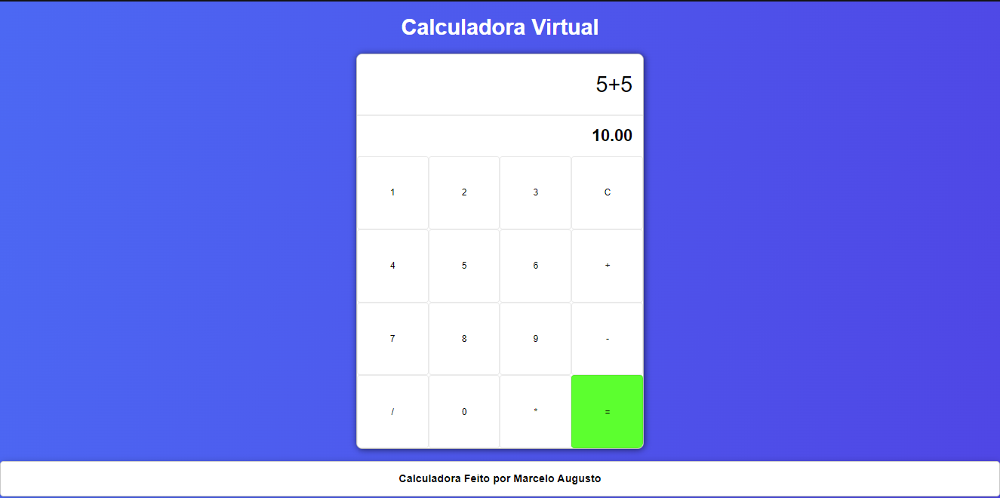

<h1 align="center">
    
    
Calculadora Virtual🧮

</h1>

<h1>👉<a href="https://marceloaugusto33.github.io/PROJETO-CALCULADORA/" target="_blank">Projeto em Ação</a></h1>

## 📕 Sobre
Este projeto consiste em uma calculadora virtual desenvolvida utilizando as tecnologias web padrão: **HTML, CSS e JavaScript**. A calculadora proporciona uma interface intuitiva e amigável, permitindo que os usuários realizem operações matemáticas básicas de forma rápida e eficiente.

## 🔨 FERRAMENTAS

- [HTML](https://developer.mozilla.org/pt-BR/docs/Web/HTML)
- [CSS](https://developer.mozilla.org/pt-BR/docs/Web/CSS)
- [JAVASCRIPT](https://developer.mozilla.org/pt-BR/docs/Web/JavaScript)

## 📃 LICENÇA
Esse projeto utiliza licença MIT. Veja o arquivo da [licença](https://github.com/MarceloAugusto33/PROJETO-CALCULADORA/blob/main/LICENSE) para mais detalhes.